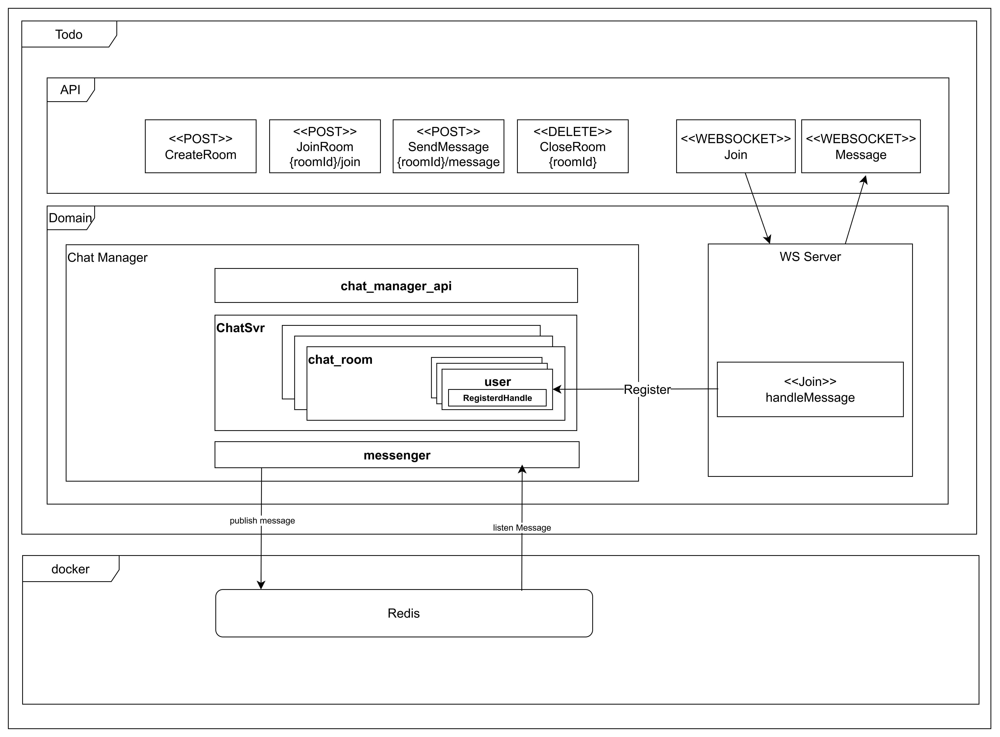

# How to build
## Install dependencies

### install Logrus
```shell
go get github.com/sirupsen/logrus
```

### install redis
```shell
go get github.com/go-redis/redis
```

### install websocket
```shell
go get github.com/gorilla/websocket
```

### install gin
```shell
go get github.com/gin-gonic/gin
```

### install google uuid
```shell
go get github.com/google/uuid
```

## build
```shell
go build -o main cmd/main.go
```

# Application Architecture



# How to run
```shell
./main
```